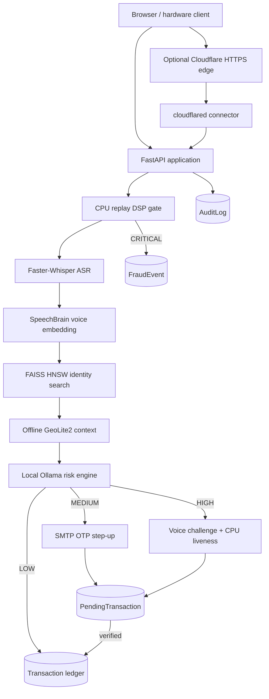

# VocalPay

VocalPay is a voice-driven payment authorization system built with FastAPI, SQLAlchemy 2.0, multimodal biometrics, offline network geolocation, and a locally hosted agentic risk engine. A user speaks a payment command, the backend transcribes the amount, resolves the enrolled speaker identity, evaluates transaction risk, and either completes the payment or freezes it for a bounded step-up verification.

> Academic project: **A Secure Voice-Based Financial Transaction System Using Multimodal Biometrics and Agentic AI Fraud Detection**

## Contents

- [Core capabilities](#core-capabilities)
- [Architecture](#architecture)
- [Transaction lifecycle](#transaction-lifecycle)
- [Risk matrix](#risk-matrix)
- [Technology stack](#technology-stack)
- [Hardware and runtime profile](#hardware-and-runtime-profile)
- [Repository layout](#repository-layout)
- [Database design](#database-design)
- [API reference](#api-reference)
- [Installation](#installation)
- [Configuration](#configuration)
- [Running VocalPay](#running-vocalpay)
- [Cloudflare Tunnel and GeoIP testing](#cloudflare-tunnel-and-geoip-testing)
- [Testing](#testing)
- [Engineering utilities](#engineering-utilities)
- [Security properties](#security-properties)
- [Current limitations](#current-limitations)

## Core capabilities

- Password signup and sign-in using an HTTP-only JWT cookie.
- Authenticated face and voice biometric enrollment.
- Voice-only transaction initiation: identity and amount are derived from a live spoken command.
- CPU-first spectral replay screening before expensive model execution.
- Faster-Whisper ASR for English payment commands and spoken challenges.
- SpeechBrain ECAPA-TDNN speaker embeddings and similarity verification.
- FAISS HNSW voiceprint search for indexed speaker identification.
- InsightFace `buffalo_l` facial embedding extraction with CUDA preference and CPU execution-provider fallback.
- Local Ollama `llama3.2:3b` risk reasoning with JSON-constrained output.
- Offline GeoLite2 country resolution from an authentic proxy-provided client IP.
- Four risk outcomes: LOW, MEDIUM, HIGH, and CRITICAL.
- Email-delivered OTP verification for MEDIUM risk.
- Combined spoken challenge and CPU liveness verification for HIGH risk.
- SQLite-backed five-minute step-up state with bounded attempts and replay prevention.
- Permanent transaction, fraud-event, and request-audit records.
- Jinja2/Tailwind-style browser interface for signup, enrollment, sign-in, dashboard, and transaction verification.

## Architecture



### Layer responsibilities

| Layer | Responsibility |
|---|---|
| `app/api/v1/endpoints` | HTTP contracts, authentication dependencies, transaction orchestration, response mapping |
| `app/services` | User, biometric, ASR, email, liveness, and local-agent services |
| `app/services/providers` | Concrete InsightFace/SpeechBrain implementations and lazy provider factory |
| `app/core` | Configuration, JWT security, DSP, upload conversion, inference coordination, GeoIP/vector support, logging, memory telemetry |
| `app/database` | Async engine, SQLAlchemy models, Pydantic schemas, persistence operations |
| `app/middleware` | Request security auditing |
| `app/templates`, `app/static` | Server-rendered pages and dashboard JavaScript |

The detailed architectural invariants are defined in [SYSTEM_ARCHITECTURE.md](SYSTEM_ARCHITECTURE.md).

## Transaction lifecycle

### Enrollment

1. The user signs up with name, email, phone number, and password.
2. The password is hashed; a UUID user ID is generated.
3. After cookie-authenticated sign-in, `/api/v1/users/enroll` receives live audio and a face photograph.
4. Uploads are decoded in memory into a mono 16 kHz `float32` waveform and OpenCV BGR matrix.
5. InsightFace produces the face template and SpeechBrain produces a 192-dimensional speaker template.
6. Only native floating-point embedding lists are stored. Raw enrollment media is not persisted.
7. The in-memory FAISS voiceprint index is rebuilt.

### Step 1: voice-driven initiation

`POST /api/v1/transactions/initiate` accepts one multipart `audio_file`.

1. A temporary request-scoped audio file is screened by the CPU DSP gate.
2. Faster-Whisper transcribes the spoken instruction.
3. A positive amount is extracted from numeric or supported English number words.
4. SpeechBrain extracts the live speaker embedding.
5. FAISS searches enrolled 192-dimensional voiceprints; the best match must meet `SPEAKER_PASS_THRESHOLD`.
6. The client network country is resolved offline when trusted proxy headers are enabled.
7. Transactions at or above INR 500 enter HIGH risk directly. Lower amounts are evaluated by Ollama with speaker and network telemetry.
8. The server either commits a completed transaction, freezes step-up state, or records a terminal fraud event.

### Step 2: stateless verification

`POST /api/v1/transactions/verify` rehydrates a `PendingTransaction` by `transaction_id`.

- **MEDIUM / `PENDING_OTP`:** the supplied six-digit OTP is HMAC-SHA256 digested and compared with the persisted digest using constant-time comparison.
- **HIGH / `PENDING_CHALLENGE`:** the client submits both a fresh audio clip and fresh camera image. The spoken phrase must match the randomized challenge and the CPU liveness score must meet `LIVENESS_CRITICAL_THRESHOLD`.

Verification uses a strict `voice_verified AND liveness_verified` predicate for HIGH risk. Success writes the permanent transaction and removes the pending row. Expired, exhausted, or already-consumed state cannot be replayed.

## Risk matrix

| Risk tier | Trigger/path | HTTP behavior | Resolution |
|---|---|---|---|
| LOW | Trusted voice, sub-500 amount, ordinary network context | `200` | Immediate ledger commit |
| MEDIUM | Foreign network country on a sub-500 transaction or agent decision | `403`, `PENDING_OTP` | Email OTP, five-minute window |
| HIGH | Amount `>= 500` or HIGH agent decision | `403`, `PENDING_CHALLENGE` | Spoken challenge plus fresh-frame liveness |
| CRITICAL | DSP replay signature or terminal agent block | `401` | Hard block and `FraudEvent` |

An HTTP `403` carrying `PENDING_OTP` or `PENDING_CHALLENGE` is an expected state-machine transition, not an application failure.

## Technology stack

| Concern | Implementation |
|---|---|
| Language | Python 3.11+ |
| API/server | FastAPI 0.115, Uvicorn 0.30 |
| Validation | Pydantic v2, pydantic-settings, EmailStr validation |
| ORM/database | SQLAlchemy 2.0 async ORM, `aiosqlite`, SQLite |
| Authentication | Passlib/bcrypt, python-jose, HS256 JWT, HTTP-only cookie |
| ASR | Faster-Whisper `small.en`, CTranslate2 |
| Speaker verification | SpeechBrain `spkrec-ecapa-voxceleb`, PyTorch CPU |
| Face biometrics | InsightFace `buffalo_l`, ONNX Runtime GPU with CPU provider fallback |
| Voice search | FAISS CPU `IndexHNSWFlat` |
| DSP/audio | librosa, NumPy, PyAV, SoundFile |
| Liveness | OpenCV Haar cascades, texture/gradient/reflection/frequency heuristics |
| Risk reasoning | Local Ollama `llama3.2:3b`, native JSON output mode |
| Email | `aiosmtplib` over TLS/STARTTLS |
| GeoIP | `geoip2` with local GeoLite2 City database |
| Logging | Loguru plus request/security audit persistence |
| Testing | pytest, pytest-asyncio, HTTPX ASGI transport |

Pinned package versions are maintained in [requirements.txt](requirements.txt).

## Hardware and runtime profile

The reference target is a Windows laptop with 16 GB system RAM and an NVIDIA RTX 2050 with a strict 4 GB VRAM ceiling.

| Component | Preferred device | Fallback/notes |
|---|---|---|
| SpeechBrain | CPU | Intentionally kept off GPU |
| InsightFace | CUDA | ONNX `CPUExecutionProvider` is listed as fallback |
| Faster-Whisper | CUDA, FP16 | Falls back to CPU INT8 if required Windows CUDA libraries are unavailable |
| Liveness and DSP | CPU | OpenCV/librosa deterministic processing |
| Ollama | Local daemon | Device selection is managed by Ollama |

`isolate_model_inference()` provides a process-wide asynchronous lock. Biometric proxies and Ollama use this coordinator so heavy inference stages do not overlap across concurrent requests. Providers are lazily constructed and cached. The application lifespan releases provider and database resources during shutdown.

## Repository layout

```text
VocalPay/
├── app/
│   ├── api/v1/endpoints/
│   │   ├── auth.py                  # Signup, login, logout, current user
│   │   ├── user.py                  # Authenticated biometric enrollment
│   │   └── transaction.py           # Initiate, verify, and history routes
│   ├── core/
│   │   ├── audio_dsp.py             # Replay heuristic gate
│   │   ├── config.py                # Pydantic settings
│   │   ├── converters.py            # In-memory media decoding
│   │   ├── inference_coordinator.py # Global inference serialization
│   │   ├── security.py              # Password and JWT primitives
│   │   ├── vector_index.py          # FAISS HNSW voice identity index
│   │   └── GeoLite2-City.mmdb       # Local GeoIP dataset (provision separately/LFS)
│   ├── database/
│   │   ├── database.py              # Async engine and startup migrations
│   │   ├── models.py                # Typed SQLAlchemy mappings
│   │   ├── schemas.py               # Pydantic API schemas
│   │   └── crud.py                  # Async persistence functions
│   ├── middleware/security_audit.py
│   ├── services/
│   │   ├── providers/               # InsightFace/SpeechBrain and factory
│   │   ├── liveness/                # Frame preparation and CPU scoring
│   │   ├── email_service.py
│   │   ├── ollama_service.py
│   │   └── whisper_service.py
│   ├── static/js/dashboard.js
│   ├── templates/
│   └── main.py
├── tests/test_stateless_pipeline.py
├── test_*.py                        # Focused component suites
├── enrollment_helper.py             # Manual camera/microphone enrollment client
├── live_tester.py                   # Manual conversational transaction client
├── reset_db.py / clear_database.py  # Development database utilities
├── SYSTEM_ARCHITECTURE.md
└── requirements.txt
```

## Database design

All request-path persistence uses `AsyncSession`. The default URL is `sqlite+aiosqlite:///./vocalpay.db`. Timestamp columns use UTC-naive storage through a central SQLAlchemy type decorator to avoid SQLite aware/naive comparison errors.

| Table | Purpose | Important properties |
|---|---|---|
| `users` | Account and enrolled templates | UUID ID, unique email/phone, hashed password, 192-D speaker list, face embedding list, active/verified state |
| `pending_transactions` | Resumable step-up state | Unique transaction ID, risk/status, HMAC digest or challenge, UTC expiry, attempt counters, active flag, telemetry |
| `transactions` | Permanent completed ledger | Outcome, amount, risk, biometric/fraud scores, XAI rationale, latency |
| `fraud_events` | Security blocks | Nullable user link, event/risk type, reason, replay flag and telemetry |
| `audit_logs` | Request security audit | Nullable non-unique transaction ID, endpoint, method, status, client metadata and latency |

Relationships use matching `back_populates` between `User` and each dependent table. Startup creates missing tables and applies narrowly scoped SQLite compatibility migrations for pending-attempt columns and nullable fraud-event users.

## API reference

All API routes use the `/api/v1` prefix.

### Authentication

| Method | Route | Input | Result |
|---|---|---|---|
| POST | `/auth/signup` | JSON: `full_name`, `email`, `phone_number`, `password` | `201`; creates account with UUID |
| POST | `/auth/login` | Form: `username` (email), `password` | Sets `access_token` HTTP-only cookie |
| GET | `/auth/me` | Authentication cookie | Current user profile |
| POST | `/auth/logout` | Authentication cookie | Clears cookie |

### Enrollment

| Method | Route | Input | Result |
|---|---|---|---|
| POST | `/users/enroll` | Auth cookie; multipart `audio_file`, `photo_file` | `201`; stores voice and face templates |

### Transactions

| Method | Route | Input | Result |
|---|---|---|---|
| POST | `/transactions/initiate` | Multipart `audio_file` | `200` LOW, `403` step-up, `401` CRITICAL |
| POST | `/transactions/verify` | Form `transaction_id`; optional `otp_code`, `audio_file`, `photo_file` according to pending status | `200` completion or verification error |
| GET | `/transactions/history?limit=20&offset=0` | Auth cookie | Newest-first authenticated user history |

### Pages and operations

| Method | Route | Purpose |
|---|---|---|
| GET | `/` | Welcome page |
| GET | `/signup` | Signup page |
| GET | `/signin` | Sign-in page |
| GET | `/enroll` | Enrollment wizard |
| GET | `/dashboard` | Transaction dashboard |
| GET | `/health` | Lightweight operational status |
| GET | `/docs` | OpenAPI/Swagger UI |

## Installation

### Prerequisites

- Python 3.11
- Git
- FFmpeg available on `PATH`
- Ollama with `llama3.2:3b`
- A webcam and microphone for live enrollment/verification
- Optional NVIDIA GPU stack compatible with the pinned PyTorch, ONNX Runtime GPU, and CTranslate2 packages
- A GeoLite2 City database for public-IP country detection
- SMTP credentials for MEDIUM-risk OTP delivery

### Windows setup

```powershell
git clone https://github.com/Aswinesag/vocal-pay-payments-project.git
cd vocal-pay-payments-project

py -3.11 -m venv venv311
.\venv311\Scripts\Activate.ps1
python -m pip install --upgrade pip
pip install -r requirements.txt
```

Install and prepare the local risk model:

```powershell
ollama pull llama3.2:3b
ollama serve
```

Model checkpoints for SpeechBrain, InsightFace, and Faster-Whisper are loaded/downloaded by their libraries on first use. That first request can take significantly longer and requires network access unless the checkpoints are already cached.

### GeoLite2 database

Place the MaxMind GeoLite2 City file at:

```text
app/core/GeoLite2-City.mmdb
```

The MMDB is large and updated periodically. Prefer Git LFS or documented local provisioning instead of committing repeated database versions into ordinary Git history. Comply with MaxMind's license and update requirements.

## Configuration

Settings are loaded from the repository-root `.env` by `app/core/config.py`. The following variables are authoritative in the current runtime:

```dotenv
APP_NAME=VocalPay Core Backend Engine
DATABASE_URL=sqlite+aiosqlite:///./vocalpay.db

LOG_LEVEL=INFO
LOG_DIRECTORY=logs
LOG_ROTATION=10 MB

OLLAMA_BASE_URL=http://localhost:11434
OLLAMA_MODEL=llama3.2:3b

WHISPER_MODEL=small.en
WHISPER_DEVICE=cuda
WHISPER_COMPUTE_TYPE=float16

INSIGHTFACE_MODEL=buffalo_l
INSIGHTFACE_DEVICE=cuda
INSIGHTFACE_PROVIDER=CUDAExecutionProvider
SPEECHBRAIN_DEVICE=cpu

SPEAKER_PASS_THRESHOLD=0.70
FACE_PASS_THRESHOLD=0.80
LIVENESS_CRITICAL_THRESHOLD=0.40
STEP_UP_TIMEOUT_SECONDS=300

JWT_SECRET_KEY=replace-with-at-least-32-random-characters
JWT_ALGORITHM=HS256
ACCESS_TOKEN_EXPIRE_MINUTES=30
REFRESH_TOKEN_EXPIRE_DAYS=7
COOKIE_SECURE=false

SMTP_HOST=smtp.gmail.com
SMTP_PORT=587
SMTP_USERNAME=your-account@example.com
SMTP_PASSWORD=your-app-password
SMTP_FROM_EMAIL=noreply@vocalpay.com
SMTP_FROM_NAME=VocalPay Security
SMTP_USE_TLS=true

TRUST_PROXY_HEADERS=false
```

Generate a JWT secret rather than using the development default:

```powershell
python -c "import secrets; print(secrets.token_urlsafe(48))"
```

`COOKIE_SECURE` should be `true` behind HTTPS. `TRUST_PROXY_HEADERS` should be `true` only when the application is reached through a controlled reverse proxy such as Cloudflare Tunnel; otherwise forwarded IP headers are spoofable.

The replay gate currently uses implementation constants in `app/core/audio_dsp.py`: a 16 kHz analysis rate, spectral roll-off threshold of 4800 Hz, and spectral-centroid threshold of 2700 Hz. Both spectral conditions must be met for a replay block.

## Running VocalPay

Start Ollama in one terminal:

```powershell
ollama serve
```

Start the API in the activated virtual environment:

```powershell
uvicorn app.main:app --host 127.0.0.1 --port 8000
```

For local development with automatic reload:

```powershell
uvicorn app.main:app --reload --host 127.0.0.1 --port 8000
```

Open <http://127.0.0.1:8000>. Startup initializes SQLite and builds the FAISS voiceprint index from enrolled users. Keep one worker for the intended process-wide inference serialization and in-memory index semantics.

Recommended browser flow:

1. Create an account at `/signup`.
2. Sign in at `/signin`.
3. Complete camera and microphone enrollment at `/enroll`.
4. Use `/dashboard` and speak a natural command such as “Authorize transaction for 150 rupees.”
5. Complete OTP or combined challenge/liveness verification when requested.

## Cloudflare Tunnel and GeoIP testing

Cloudflare Tunnel is optional and transports requests to the local origin; it performs no biometric or agent inference.

```powershell
cloudflared tunnel --protocol http2 --edge-ip-version 4 --url http://127.0.0.1:8000
```

Open the generated `https://...trycloudflare.com` URL. For demonstration testing through a VPN, keep `cloudflared` on a stable network path and route the browser through the VPN. The backend prioritizes `CF-Connecting-IP`, then the first `X-Forwarded-For` value, only when `TRUST_PROXY_HEADERS=true`.

- Localhost resolves to the development baseline country, India.
- A public foreign country on a sub-500 transaction forces MEDIUM/OTP behavior.
- Cloudflare's connector requires outbound connectivity to its edge, including port 7844.
- Quick Tunnels are for demonstrations; use a named tunnel and controlled hostname for persistent deployment.

## Testing

Run the configured suite:

```powershell
pytest -v
```

Run the state-machine integration suite directly:

```powershell
pytest tests/test_stateless_pipeline.py -v
```

The integration suite uses HTTPX `ASGITransport`, function-scoped async database isolation, and mocks for heavy biometric/ASR/Ollama operations. It validates:

- Cookie-authenticated signup and enrollment.
- HIGH-risk freeze and combined voice/liveness verification.
- Missing-liveness rejection.
- Pending-token consumption and replay prevention.
- Foreign-country MEDIUM risk and OTP flow.
- Provider adapter lifecycle behavior.

Focused root suites cover SQLAlchemy mappings, CRUD, schemas, configuration, middleware, dependencies, services, provider contracts, and concrete providers.

Hardware tests should be run deliberately because they load real models or open devices:

```powershell
python test_live_face.py
python enrollment_helper.py
python live_tester.py
```

## Engineering utilities

| Utility | Purpose |
|---|---|
| `enrollment_helper.py` | Captures one webcam frame and five seconds of 16 kHz microphone audio, then submits enrollment |
| `live_tester.py` | Captures a spoken transaction and handles LOW or step-up responses with hardware input |
| `app/tools/face_validation.py` | Manual live face detection/embedding diagnostics |
| `reset_db.py` | Drops all mapped tables and initializes an empty schema; destructive |
| `clear_database.py` | Development database cleanup workflow; destructive |
| `migrate_database.py` | Local schema migration helper |
| `verify_database.py`, `quick_verify.py` | Database/runtime verification helpers |
| `diagnose_startup.py` | Startup diagnostic script |

Back up any required records before using reset or cleanup tools.

## Security properties

- Passwords are stored as bcrypt hashes, never plaintext.
- JWT access tokens are delivered through HTTP-only, SameSite=Lax cookies.
- Biometric templates are numerical vectors; raw enrollment media is not stored.
- OTPs are generated with `secrets`, emailed to the registered address, and persisted only as keyed HMAC-SHA256 digests.
- OTP comparisons use `secrets.compare_digest`.
- Pending verification has a five-minute server-side expiry and bounded attempts.
- Completed verification deletes the pending state to prevent token replay.
- CRITICAL replay decisions short-circuit before model inference and are recorded as fraud events.
- HIGH risk requires both the randomized spoken phrase and liveness threshold.
- Heavy inference is globally serialized to protect the 4 GB VRAM budget.
- Ollama receives structured telemetry, not raw biometric media, and must return a fixed JSON schema.
- GeoIP lookup is local; no third-party location API receives client addresses.
- Security middleware records 401/403 request context without persisting credentials or multipart biometric bodies.

## Current limitations

- SQLite and `create_all`/targeted startup migrations are suitable for the academic/development deployment. A production PostgreSQL deployment should use a formal migration system such as Alembic.
- Wildcard CORS is enabled for sandbox demonstration and must be replaced with explicit trusted origins before deployment.
- The liveness detector is a deterministic, single-frame OpenCV heuristic. It is not a certified presentation-attack-detection system and does not prove blink motion from one image.
- Voice enrollment currently stores one template; production accuracy would benefit from multiple quality-controlled samples and evaluated threshold calibration.
- GeoLite2 country resolution is approximate and depends on database freshness. Location is a risk signal, not proof of user presence.
- Quick Tunnel URLs are ephemeral and are not a production ingress strategy.
- Local model initialization can be slow on first use and depends on compatible native CUDA/CTranslate2/ONNX libraries when GPU execution is selected.
- The reference inference lock is process-wide, not distributed across multiple Uvicorn workers. The intended constrained-hardware deployment uses one worker.

## License and data notices

No repository license is currently declared. Add an explicit license before redistribution. SpeechBrain, InsightFace, Faster-Whisper, Ollama models, and GeoLite2 data retain their respective upstream licenses and usage conditions.
